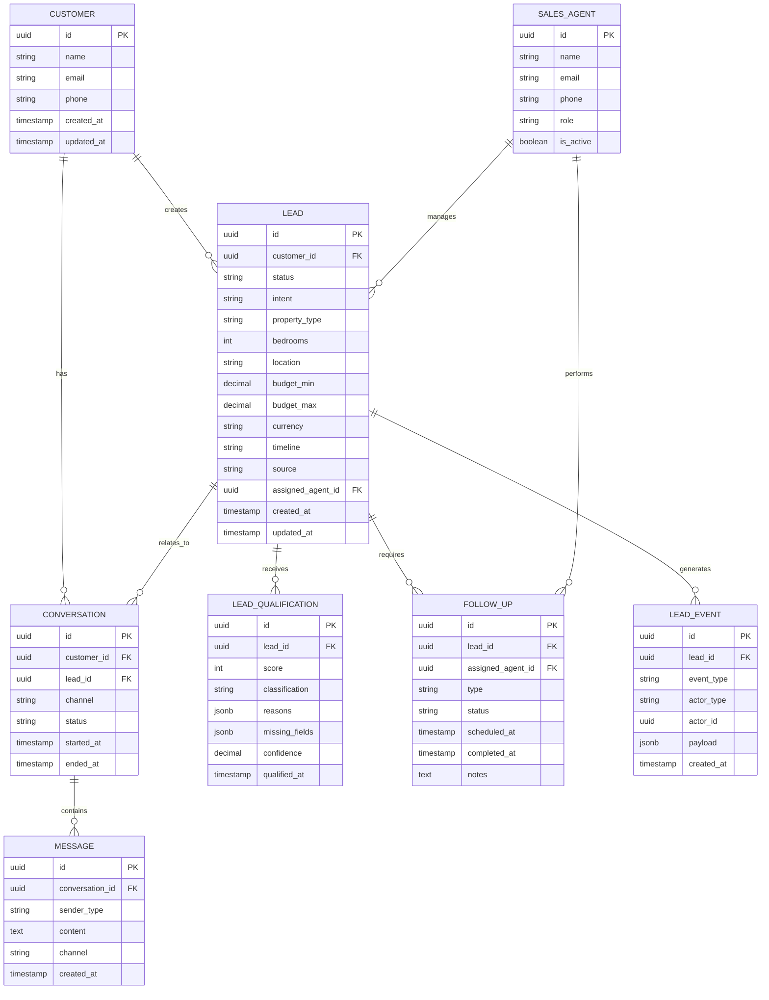

# Data Model

## 1. Purpose

This document defines how data is structured, stored, related, validated, and synchronized across the **Real Estate Lead Bot** system.

The data model is the bridge between:

- React frontend
- FastAPI backend
- n8n automation
- AI processing
- SQL database
- Google Sheets
- Sales team workflows

The goal is to create a data structure that is:

- Consistent
- Searchable
- Scalable
- Easy to validate
- Easy for humans to understand
- Easy for AI coding assistants to work with
- Safe to change through database migrations

---

# 2. Source of Truth

The system will use a **SQL database as the primary source of truth**.

Google Sheets will be used as a secondary operational/reporting surface where appropriate.

```text
                 ┌─────────────────────┐
                 │     React UI        │
                 └──────────┬──────────┘
                            │
                            ▼
                 ┌─────────────────────┐
                 │   FastAPI Backend   │
                 └──────────┬──────────┘
                            │
                            ▼
                 ┌─────────────────────┐
                 │    SQL Database     │
                 │   SOURCE OF TRUTH   │
                 └──────────┬──────────┘
                            │
                            ▼
                       ┌────────┐
                       │  n8n   │
                       └────┬───┘
                            │
                            ▼
                    ┌───────────────┐
                    │ Google Sheets │
                    │  Reporting /  │
                    │  Operations   │
                    └───────────────┘
```

### Important Rule

Google Sheets must **not** become the authoritative database for the application.

If there is a conflict between SQL and Google Sheets:

```text
SQL Database = authoritative
Google Sheets = secondary copy / operational view
```

---

# 3. Recommended Database

For production, the preferred SQL database is:

**PostgreSQL**

Reasons:

- Strong relational database capabilities
- Excellent support for structured data
- Reliable transactions
- Good indexing
- JSON/JSONB support
- Works well with Python and FastAPI
- Works well with modern ORMs
- Suitable for future growth

The exact hosting provider can be decided later.

---

# 4. Core Entities

The MVP will use the following primary entities:

```text
Customer
   │
   └── Lead
          │
          ├── Conversation
          │      └── Message
          │
          ├── Lead Qualification
          │
          ├── Follow-Up
          │
          └── Lead Events / Audit Log

Sales Agent
   │
   └── Lead Assignment
```

### Core tables

| Entity | Purpose |
|---|---|
| `customers` | Stores customer identity/contact information |
| `leads` | Stores the customer's property requirement and sales opportunity |
| `conversations` | Stores conversation sessions |
| `messages` | Stores individual customer/bot/agent messages |
| `lead_qualifications` | Stores lead score and qualification results |
| `follow_ups` | Stores planned and completed sales follow-ups |
| `sales_agents` | Stores sales team members |
| `lead_events` | Stores important system events and audit history |

---

# 5. Entity: Customer

A customer represents the person interacting with the real-estate business.

### Suggested fields

| Field | Type | Required | Description |
|---|---|---:|---|
| `id` | UUID | Yes | Unique customer ID |
| `name` | VARCHAR | No | Customer's name |
| `email` | VARCHAR | No | Customer email |
| `phone` | VARCHAR | No | Customer phone number |
| `created_at` | TIMESTAMP | Yes | Creation time |
| `updated_at` | TIMESTAMP | Yes | Last update time |

### Example

```json
{
  "id": "customer_123",
  "name": "John Doe",
  "email": "john@example.com",
  "phone": "+2348012345678"
}
```

### Rules

- Email should be normalized before storage.
- Phone numbers should use a consistent format.
- Do not create duplicate customers unnecessarily.
- Customer identity should be separated from individual leads.

---

# 6. Entity: Lead

A lead represents a potential business opportunity.

A customer may have multiple leads over time.

For example:

```text
Customer: John Doe

Lead #1
→ Wants 3-bedroom apartment in Lekki
→ Budget ₦80M

Lead #2
→ Wants land in Ibadan
→ Budget ₦20M
```

### Suggested fields

| Field | Type | Required | Description |
|---|---|---:|---|
| `id` | UUID | Yes | Unique lead ID |
| `customer_id` | UUID | Yes | Related customer |
| `status` | ENUM | Yes | Current lead status |
| `intent` | ENUM | Yes | Buying, renting, selling, etc. |
| `property_type` | ENUM | No | Apartment, house, land, etc. |
| `bedrooms` | INTEGER | No | Number of bedrooms |
| `location` | VARCHAR | No | Desired location |
| `budget_min` | DECIMAL | No | Minimum budget |
| `budget_max` | DECIMAL | No | Maximum budget |
| `currency` | VARCHAR | Yes | Currency, e.g. NGN |
| `timeline` | ENUM | No | Desired purchase/rental timeframe |
| `source` | VARCHAR | No | Website, WhatsApp, referral, etc. |
| `assigned_agent_id` | UUID | No | Assigned sales agent |
| `created_at` | TIMESTAMP | Yes | Creation time |
| `updated_at` | TIMESTAMP | Yes | Last update time |

---

# 7. Lead Status

Lead status represents where the lead currently is in the sales process.

```text
NEW
  ↓
QUALIFYING
  ↓
QUALIFIED
  ↓
CONTACTED
  ↓
IN_PROGRESS
  ↓
CONVERTED
```

Alternative terminal states:

```text
LOST
CLOSED
```

### Recommended enum

```text
NEW
QUALIFYING
QUALIFIED
CONTACTED
IN_PROGRESS
CONVERTED
LOST
CLOSED
```

### Important Rule

Lead status must be controlled by defined state transitions.

The system should not allow arbitrary status changes without validation.

---

# 8. Lead Intent

The AI should classify the customer's primary intent.

Possible values:

```text
BUY
RENT
SELL
LAND
PROPERTY_ENQUIRY
UNKNOWN
```

Example:

> "I want to buy a three-bedroom apartment in Lekki."

```json
{
  "intent": "BUY"
}
```

Example:

> "I have land in Abuja that I want to sell."

```json
{
  "intent": "SELL"
}
```

---

# 9. Property Type

Possible values:

```text
APARTMENT
HOUSE
DUPLEX
TERRACE
PENTHOUSE
LAND
OFFICE
SHOP
COMMERCIAL
OTHER
UNKNOWN
```

The list may expand as the product evolves.

---

# 10. Bedrooms

Bedrooms should be stored as an integer.

Examples:

```text
1
2
3
4
5
```

For properties where bedrooms do not apply:

```text
NULL
```

Do not use:

```text
"three bedrooms"
"3 bedroom"
"3BR"
```

as the database value.

The AI may receive natural language, but the backend should normalize it.

---

# 11. Budget

Budget should not be stored as free-form text when possible.

Instead:

```text
budget_min
budget_max
currency
```

Example:

```json
{
  "budget_min": 70000000,
  "budget_max": 80000000,
  "currency": "NGN"
}
```

### Why?

This makes it possible to perform queries such as:

```text
Find leads with budget >= ₦50M
```

or:

```text
Find leads interested in properties between ₦50M and ₦100M
```

---

# 12. Timeline

Possible values:

```text
IMMEDIATELY
WITHIN_1_MONTH
WITHIN_3_MONTHS
WITHIN_6_MONTHS
JUST_RESEARCHING
UNKNOWN
```

Example:

> "I want to move as soon as possible."

```text
IMMEDIATELY
```

---

# 13. Lead Source

The source identifies where the lead originated.

Examples:

```text
WEBSITE
CHATBOT
WHATSAPP
INSTAGRAM
FACEBOOK
REFERRAL
PHONE
EMAIL
OTHER
```

The exact channel list can evolve.

---

# 14. Conversation

A conversation represents a continuous interaction between a customer and the system.

Relationship:

```text
Customer
   │
   └── Conversations
           │
           └── Messages
```

### Suggested fields

| Field | Type | Required | Description |
|---|---|---:|---|
| `id` | UUID | Yes | Conversation ID |
| `customer_id` | UUID | Yes | Customer |
| `lead_id` | UUID | No | Associated lead |
| `channel` | VARCHAR | Yes | Website, WhatsApp, etc. |
| `status` | ENUM | Yes | Active, closed |
| `started_at` | TIMESTAMP | Yes | Start time |
| `ended_at` | TIMESTAMP | No | End time |
| `created_at` | TIMESTAMP | Yes | Creation timestamp |
| `updated_at` | TIMESTAMP | Yes | Last update |

---

# 15. Message

A message represents an individual communication.

Possible senders:

```text
CUSTOMER
AI_AGENT
SALES_AGENT
SYSTEM
```

### Suggested fields

| Field | Type | Required | Description |
|---|---|---:|---|
| `id` | UUID | Yes | Message ID |
| `conversation_id` | UUID | Yes | Conversation |
| `sender_type` | ENUM | Yes | Who sent it |
| `content` | TEXT | Yes | Message content |
| `channel` | VARCHAR | Yes | Communication channel |
| `created_at` | TIMESTAMP | Yes | Message timestamp |

Optional AI metadata:

```text
ai_model
ai_confidence
processing_time_ms
```

---

# 16. Lead Qualification

Lead qualification stores the system's assessment of the value and urgency of a lead.

### Suggested fields

| Field | Type | Required | Description |
|---|---|---:|---|
| `id` | UUID | Yes | Qualification ID |
| `lead_id` | UUID | Yes | Lead |
| `score` | INTEGER | Yes | Numeric score |
| `classification` | ENUM | Yes | HOT, WARM, COLD |
| `reasons` | JSONB | No | Reasons for classification |
| `missing_fields` | JSONB | No | Information still required |
| `confidence` | DECIMAL | No | AI confidence |
| `qualified_at` | TIMESTAMP | Yes | Qualification time |

### Example

```json
{
  "score": 87,
  "classification": "HOT",
  "reasons": [
    "High budget",
    "Immediate timeline",
    "Specific property requirement"
  ],
  "missing_fields": [],
  "confidence": 0.94
}
```

---

# 17. Qualification Rules

The qualification score should be calculated using explicit business rules.

Example:

```text
Budget provided
        +
Specific location
        +
Property type provided
        +
Clear buying/renting intent
        +
Immediate timeline
        =
Higher qualification score
```

The exact scoring algorithm should be defined in:

```text
AI_AGENT_SPEC.md
```

or a dedicated business rules module.

### Important Rule

The AI should not have unrestricted authority to invent or arbitrarily modify the score.

The backend should validate the qualification result.

---

# 18. Follow-Up

A follow-up represents an action that a sales agent needs to perform.

Examples:

```text
Call customer
Send property listings
Schedule viewing
Send WhatsApp message
Email customer
```

### Suggested fields

| Field | Type | Required | Description |
|---|---|---:|---|
| `id` | UUID | Yes | Follow-up ID |
| `lead_id` | UUID | Yes | Related lead |
| `assigned_agent_id` | UUID | No | Assigned agent |
| `type` | ENUM | Yes | Call, email, WhatsApp, etc. |
| `status` | ENUM | Yes | Pending, completed, cancelled |
| `scheduled_at` | TIMESTAMP | No | Scheduled time |
| `completed_at` | TIMESTAMP | No | Completion time |
| `notes` | TEXT | No | Agent notes |
| `created_at` | TIMESTAMP | Yes | Creation timestamp |
| `updated_at` | TIMESTAMP | Yes | Last update |

---

# 19. Sales Agent

A sales agent represents a member of the sales team.

### Suggested fields

| Field | Type | Required | Description |
|---|---|---:|---|
| `id` | UUID | Yes | Agent ID |
| `name` | VARCHAR | Yes | Agent name |
| `email` | VARCHAR | Yes | Agent email |
| `phone` | VARCHAR | No | Agent phone |
| `role` | ENUM | Yes | Agent, Manager, Admin |
| `is_active` | BOOLEAN | Yes | Whether agent is active |
| `created_at` | TIMESTAMP | Yes | Creation timestamp |
| `updated_at` | TIMESTAMP | Yes | Last update |

---

# 20. Lead Events / Audit Log

Important system events should be recorded.

Examples:

```text
lead.created
lead.updated
lead.qualified
lead.assigned
lead.status_changed
message.received
message.processed
follow_up.created
follow_up.completed
```

### Suggested fields

| Field | Type | Required | Description |
|---|---|---:|---:|
| `id` | UUID | Yes | Event ID |
| `lead_id` | UUID | No | Related lead |
| `event_type` | VARCHAR | Yes | Event name |
| `actor_type` | ENUM | Yes | Customer, AI, Agent, System |
| `actor_id` | UUID | No | Actor ID |
| `payload` | JSONB | No | Event data |
| `created_at` | TIMESTAMP | Yes | Event timestamp |

This gives the system an audit trail.

---

# 21. Entity Relationships



---

# 22. Database Constraints

The database should enforce important rules wherever possible.

### Customer

```text
email
```

should have appropriate indexing.

### Lead

```text
customer_id
```

must reference an existing customer.

```text
assigned_agent_id
```

must reference an existing sales agent when provided.

### Bedrooms

Must not be negative.

```text
bedrooms >= 0
```

### Budget

```text
budget_min >= 0
budget_max >= 0
```

If both exist:

```text
budget_min <= budget_max
```

### Qualification

Score should remain within the defined range.

Example:

```text
0 <= score <= 100
```

---

# 23. Indexing Strategy

Indexes should be created for frequently queried fields.

Recommended indexes:

```text
customers.email

customers.phone

leads.customer_id

leads.status

leads.intent

leads.location

leads.assigned_agent_id

leads.created_at

lead_qualifications.lead_id

lead_qualifications.classification

follow_ups.lead_id

follow_ups.assigned_agent_id

follow_ups.scheduled_at

messages.conversation_id

messages.created_at

lead_events.lead_id

lead_events.created_at
```

Do not create indexes for every field automatically.

Indexes should support real query patterns.

---

# 24. Timestamps

All major entities should use:

```text
created_at
updated_at
```

Where applicable:

```text
completed_at
scheduled_at
qualified_at
started_at
ended_at
```

Store timestamps consistently in **UTC** at the database/application layer.

The frontend can convert them to the user's local timezone.

---

# 25. UUIDs

Use UUIDs for primary identifiers.

Example:

```text
customer_id
lead_id
conversation_id
message_id
follow_up_id
agent_id
```

Example:

```text
550e8400-e29b-41d4-a716-446655440000
```

### Why?

UUIDs:

- Reduce predictable sequential IDs
- Work well across distributed systems
- Are suitable for API resources
- Make record merging easier
- Work well with n8n events

---

# 26. AI Data Handling

AI-generated information must be treated as **untrusted input** until validated.

Example customer message:

> "I'm looking for a 3-bedroom apartment in Lekki for about 80 million."

AI may produce:

```json
{
  "intent": "BUY",
  "property_type": "APARTMENT",
  "bedrooms": 3,
  "location": "Lekki",
  "budget_max": 80000000,
  "currency": "NGN"
}
```

The backend should then:

```text
AI output
   ↓
Schema validation
   ↓
Business validation
   ↓
Normalization
   ↓
Database
```

Never:

```text
AI output
   ↓
Database
```

without validation.

---

# 27. Missing Information

The database should allow optional lead fields.

For example:

```text
Customer:
"I want to buy a house."
```

The lead may initially contain:

```json
{
  "intent": "BUY",
  "property_type": "HOUSE",
  "location": null,
  "bedrooms": null,
  "budget_min": null,
  "budget_max": null,
  "timeline": null
}
```

The system should not invent missing values.

Instead, the AI should ask the customer for the information needed to continue qualification.

---

# 28. AI Extraction Metadata

For traceability, AI processing metadata may be stored separately or inside controlled JSON fields.

Possible information:

```text
model
prompt_version
confidence
processing_timestamp
extracted_fields
missing_fields
```

Example:

```json
{
  "model": "gemini",
  "prompt_version": "v1.2",
  "confidence": 0.93,
  "extracted_fields": [
    "intent",
    "location",
    "budget"
  ]
}
```

Do not store unnecessary sensitive information.

---

# 29. Google Sheets Synchronization

Google Sheets should be treated as a secondary operational surface.

Example:

```text
SQL Database
     ↓
n8n
     ↓
Google Sheets
```

Possible spreadsheet columns:

```text
Lead ID
Customer Name
Email
Phone
Intent
Property Type
Bedrooms
Location
Budget
Timeline
Lead Score
Classification
Lead Status
Assigned Agent
Created At
```

### Important Rule

Sales staff may use the spreadsheet for visibility and reporting, but critical application state should remain in SQL.

---

# 30. Synchronization Rules

n8n should not blindly overwrite SQL records.

Recommended flow:

```text
SQL
 ↓
n8n
 ↓
Transform
 ↓
Google Sheets
```

If a sales agent changes a spreadsheet value:

```text
Google Sheets
 ↓
n8n
 ↓
Validate
 ↓
FastAPI
 ↓
SQL
```

The backend should validate the change before updating the database.

---

# 31. Duplicate Prevention

The system should reduce duplicate leads.

Possible duplicate signals:

```text
Same customer email
+
Same phone number
+
Same active property requirement
```

However, duplicate detection should not automatically merge records without validation.

Example:

A customer can legitimately create two separate leads:

```text
Lead A → Buy apartment in Lekki

Lead B → Buy land in Ibadan
```

Therefore:

```text
Same customer ≠ automatically same lead
```

---

# 32. Data Lifecycle

A simplified lead lifecycle:

```text
Customer sends message
        ↓
Customer created/found
        ↓
Lead created
        ↓
Conversation created
        ↓
Message stored
        ↓
AI extracts requirements
        ↓
Lead updated
        ↓
Qualification calculated
        ↓
Sales agent assigned
        ↓
Follow-up created
        ↓
Lead contacted
        ↓
Lead converted / lost / closed
```

---

# 33. Data Flow

```text
Customer
   │
   ▼
React
   │
   ▼
FastAPI
   │
   ├──────────────► Customer
   │
   ├──────────────► Lead
   │
   └──────────────► Conversation
                         │
                         ▼
                       Message
                         │
                         ▼
                        n8n
                         │
                         ▼
                        AI
                         │
                         ▼
                Structured AI Output
                         │
                         ▼
                   Validation
                         │
                         ▼
                Lead Qualification
                         │
                         ▼
                    SQL Database
                         │
                         ▼
                       n8n
                         │
             ┌───────────┴───────────┐
             ▼                       ▼
      Google Sheets             Sales Alert
```

---

# 34. Database vs Google Sheets

| Capability | SQL Database | Google Sheets |
|---|---|---|
| Primary data storage | ✅ | ❌ |
| Relationships | ✅ | Limited |
| Data validation | Strong | Moderate |
| Transactions | ✅ | ❌ |
| High-volume data | ✅ | Limited |
| Reporting | Good | Excellent |
| Human editing | Limited | Excellent |
| n8n integration | ✅ | ✅ |
| Production source of truth | ✅ | ❌ |
| Quick business visibility | Good | Excellent |

### Decision

Use:

```text
SQL = Application Database
Google Sheets = Operational / Reporting Layer
```

---

# 35. Future Entities

The following entities may be added later:

```text
Property
Property Listing
Property Viewing
Notification
User
Role
Organization
Sales Activity
Analytics
Payment
```

These should not be added to the MVP database unless required by the actual product requirements.

---

# 36. Migration Strategy

Database schema changes must use migrations.

Example:

```text
Migration 001
→ Create customers

Migration 002
→ Create leads

Migration 003
→ Create conversations

Migration 004
→ Create messages

Migration 005
→ Create qualifications

Migration 006
→ Create follow-ups
```

Never modify production database structures manually without recording the change in a migration.

---

# 37. AI Coding Assistant Rules

Any AI coding assistant working on this project must follow these rules.

### Rule 1 — Do not change the schema casually

Before changing a database field:

```text
Check PRD
↓
Check DATA_MODEL.md
↓
Check API_SPEC.md
↓
Determine impact
↓
Create migration
↓
Update affected schemas
↓
Update tests
```

### Rule 2 — Never delete production data during development without explicit approval

Do not generate destructive commands such as:

```text
DROP DATABASE
DROP TABLE
DELETE FROM leads
```

unless explicitly requested and confirmed.

### Rule 3 — Keep API and database contracts aligned

If:

```text
DATA_MODEL.md
```

changes, check:

```text
API_SPEC.md
TECHNICAL_SPEC.md
```

for required updates.

### Rule 4 — Validate AI output

AI output must never bypass application validation.

### Rule 5 — Preserve backwards compatibility where possible

Schema changes should avoid breaking existing API clients.

---

# 38. Testing Requirements

Database tests should verify:

### Customer

```text
Create customer
Update customer
Prevent invalid email formats
Handle duplicate contact information
```

### Lead

```text
Create lead
Update lead
Validate budget
Validate bedrooms
Validate status
Validate customer relationship
```

### Qualification

```text
Score between 0 and 100
Valid classification
Valid lead relationship
```

### Follow-up

```text
Valid lead
Valid sales agent
Valid scheduled time
Valid status transitions
```

### Relationships

```text
Customer → Lead
Lead → Conversation
Conversation → Message
Lead → Qualification
Lead → Follow-up
Sales Agent → Lead
```

---

# 39. MVP Data Model

For the first working version, implement only:

```text
customers
leads
conversations
messages
lead_qualifications
follow_ups
sales_agents
lead_events
```

Do not over-engineer the first version.

The goal is to support the complete lead journey:

```text
Message
 ↓
Lead
 ↓
Qualification
 ↓
Sales Follow-up
 ↓
Conversion
```

---

# 40. Definition of Done

The data model is considered ready for implementation when:

- [ ] Core entities are defined
- [ ] Relationships are defined
- [ ] Primary keys are defined
- [ ] Foreign keys are defined
- [ ] Required fields are identified
- [ ] Optional fields are identified
- [ ] Enums are defined
- [ ] Validation rules are defined
- [ ] Indexing strategy is defined
- [ ] Timestamp strategy is defined
- [ ] AI-generated data validation is defined
- [ ] SQL is confirmed as the source of truth
- [ ] Google Sheets synchronization strategy is defined
- [ ] Migration strategy is defined
- [ ] API/database relationships are understood
- [ ] Database testing requirements are defined

---

# 41. Document Relationships

The complete engineering documentation chain is:

```text
PRD.md
  │
  │ defines WHAT we are building
  ▼
SYSTEM_ARCHITECTURE.md
  │
  │ defines WHERE components live
  ▼
TECHNICAL_SPEC.md
  │
  │ defines HOW components are implemented
  ▼
API_SPEC.md
  │
  │ defines HOW components communicate
  ▼
DATA_MODEL.md
  │
  │ defines HOW application data is structured
  ▼
AI_AGENT_SPEC.md
  │
  │ defines HOW AI understands and processes data
  ▼
N8N_WORKFLOW_SPEC.md
  │
  │ defines HOW automation moves data
  ▼
UI_UX_SPEC.md
  │
  │ defines HOW users interact with the system
  ▼
Implementation
```

---

# 42. Final Principle

The database should represent the **business reality** of the system, not simply the structure of the UI or the output of an AI model.

The architecture should follow:

```text
Business Requirement
        ↓
Data Model
        ↓
API Contract
        ↓
Application Logic
        ↓
AI Processing
        ↓
Automation
        ↓
User Interface
```

The database is therefore a foundational system component and must be treated as a carefully designed contract rather than a storage location.